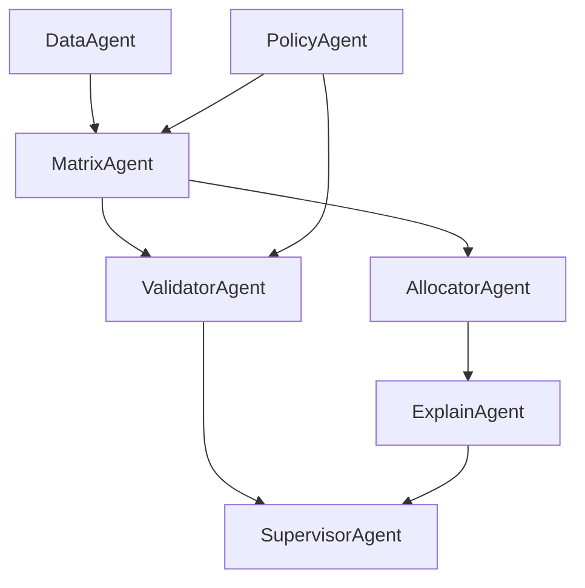

# **AGENTS.md — Eligibility Matrix (v1.0.3)**

**Parent Spec:** `Policy-Eligibility-Matrix-v1.0.3.md`
 **Alignment:** ✅ 100% SSoT Compliant
 **Purpose:** هماهنگی بین Agentهای تحلیلی، ساخت، و تخصیص در اکوسیستم Eligibility Matrix

------

## 🧠 1. System Overview

این سیستم شامل چند ایجنت تخصصی است که هر کدام یک بخش از سیاست مادر را اجرا یا اعتبارسنجی می‌کنند. هدف اصلی:

> تولید، تست و به‌کارگیری ماتریس احراز صلاحیت مطابق با Policy واحد و قابل ممیزی.

------

## ⚙️ 2. Agent Roles

| Agent               | Description                                                  | Input                                 | Output                        | Key Dependencies            |
| ------------------- | ------------------------------------------------------------ | ------------------------------------- | ----------------------------- | --------------------------- |
| **DataAgent**       | بارگذاری و نرمال‌سازی داده‌ها از Excelها                       | Inspactor, School, Crosswalk          | DataFrames یکتا               | pandas, normalization rules |
| **PolicyAgent**     | تفسیر قواعد سند مادر و تبدیل به ساختار اجرایی JSON           | `Policy-Eligibility-Matrix-v1.0.3.md` | policy.json                   | regex, markdown parser      |
| **MatrixAgent**     | ساخت ماتریس طبق قواعد Policy                                 | نرمال‌شده + policy.json                | eligibility_matrix.xlsx       | numpy/pandas                |
| **ValidatorAgent**  | بررسی انطباق خروجی با Policy (QA checklist)                  | matrix.xlsx                           | validation report             | diff engine                 |
| **AllocatorAgent**  | تخصیص دانش‌آموز به پشتیبان                                    | matrix.xlsx + student inputs          | allocation result + trace log | ranking rules               |
| **ExplainAgent**    | تولید گزارش قابل‌خواندن از تصمیمات تخصیص                      | trace logs                            | readable audit.md             | log parser                  |
| **SupervisorAgent** | ناظر کل؛ مانیتور نسخه، هم‌ترازی ایجنت‌ها، هماهنگی اجرای Pipeline | تمام ایجنت‌ها                          | meta report                   | version control             |

------

## 🧩 3. Agent Interaction Map



------

## 🔄 4. Workflow Summary

1. **DataAgent** ورودی‌ها را بارگذاری و نرمال می‌کند (بند 3 Policy).
2. **PolicyAgent** سند مادر را به JSON اجرایی تبدیل می‌کند (بند 15).
3. **MatrixAgent** با اجرای بندهای 4–9 ماتریس را می‌سازد.
4. **ValidatorAgent** بندهای QA (13) را بررسی می‌کند.
5. **AllocatorAgent** تخصیص را بر اساس بند 10 انجام می‌دهد.
6. **ExplainAgent** گزارش Explainability (بند 12) می‌سازد.
7. **SupervisorAgent** تطبیق نسخه و کنترل نهایی را مدیریت می‌کند.

------

## 🧾 5. Interface Specification

### Input Files

| File                   | Required   | Description         |
| ---------------------- | ---------- | ------------------- |
| `InspactorReport.xlsx` | ✅          | منبع اصلی پشتیبان‌ها |
| `SchoolReport.xlsx`    | ✅          | نگاشت کد مدرسه      |
| `Crosswalk.xlsx`       | ✅          | نگاشت گروه آزمایشی  |
| `StudentReport.xlsx`   | ⛔ Optional | ورودی تخصیص یا تست  |

### Output Files

| File                      | Description         |
| ------------------------- | ------------------- |
| `eligibility_matrix.xlsx` | خروجی اصلی          |
| `validation.xlsx`         | گزارش کنترل کیفیت   |
| `allocation_trace.md`     | گزارش تصمیمات تخصیص |

------

## 🧱 6. Policy Binding

هر ایجنت باید Policy مادر را در حافظه داشته باشد و مطمئن شود که:

```json
"version": "1.0.3",
"school_code_empty_as_zero": true,
"ranking": ["min_occupancy_ratio","min_allocations_new","min_mentor_id"]
```

در تمامی عملیات‌ها رعایت می‌شود.

------

## 🧮 7. QA Checklist (Auto-validation)

-  ستون‌های ورودی کامل و نرمال‌شده‌اند
-  Crosswalk و Synonyms بارگذاری شده‌اند
-  School mappings معتبرند
-  R0 Gate اجرا شده یا ثبت `r0_skipped=1`
-  خروجی matrix دارای sort پایدار و counter است
-  Sheets کمکی تولید شده‌اند
-  تخصیص دانش‌آموز تست و Trace ثبت شده است

------

## 📦 8. Version & Deployment

| Component         | Version | Purpose                 |
| ----------------- | ------- | ----------------------- |
| Policy Spec       | v1.0.3  | Master Truth            |
| Matrix Builder    | v1.0.4  | Python Reference        |
| WordPress Plugin  | v1.0.0  | Web Interface           |
| Integration Layer | v0.9    | Bridge for ImportToSabt |

------

## 🧰 9. Developer Notes

- فایل `build_matrix.py` باید با نسخه‌ی Policy هماهنگ باشد.
- هر commit باید شامل `policy_version` در متادیتا باشد.
- تغییر در Policy ⇒ بازسازی کامل ماتریس.
- نسخه‌ها توسط `SupervisorAgent` کنترل می‌شوند.

------

## ✅ 10. Compatibility Assurance

**AGENTS.md v5+ compatible**

- Modular structure
- Role-based reasoning chain
- Deterministic I/O
- Trace logging ready
- Full JSON interoperability